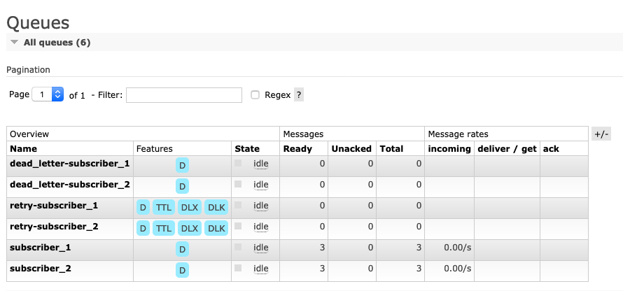
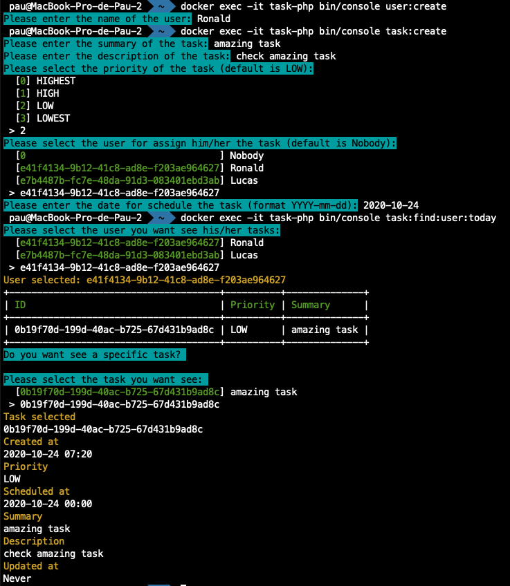

<h1 align="center">
Ports and Adapters, DDD & Event Driven Architecture  in PHP
</h1>

<p align="center">
    <a href="https://github.com/pgrau/task/actions"></a>
</p>

<p align="left">
This project follow the Event Sourcing pattern described on <a href="https://docs.microsoft.com/en-us/azure/architecture/patterns/event-sourcing"/>Microsoft Site</a>.
</p>

<p align="center">
  <a href="https://docs.microsoft.com/en-us/azure/architecture/patterns/event-sourcing">
    
  </a>
</p>


### ✔ Technology project
<p>This project have the follow features</p>
<p>1. All events are stored on the Event Store</p>
<p>2. Subscribers build materialized views</p>
<p>3. External systems and applications have available all domain events by message queue</p>

### 🖥️ Stack Technology

<p>PHP 7.4</p>
<p>MySQL 8</p>
<p>RabbitMQ 3.7</p>

## 🚀 Environment Setup

### 🐳 Needed tools

1. [Install Docker](https://www.docker.com/get-started)
2. Clone this project: `git clone https://github.com/pgrau/task`
3. Move to the project folder: `cd task`

### 🛠️ Environment configuration

1. All params are defined on `.env`  file

### 🔥 Application execution

1. Install all the dependencies and bring up the project with Docker executing:
    
    `./build.sh start` -> run docker images
    
    `./build.sh configure` -> configure all dependencies project
    
2. This app is only available by Command Interface Line
   You can see all availables command executing:
   
   `docker exec -it task-php bin/console`
   
   You can see all domain event published on RabbitMQ - exchange `domain_events` on 
   
   http://localhost:8090 (guess/guess)
   
    
   
## 👩‍💻 Project explanation

This project tries to be a Task Manager App.

You can:

1. Create users `docker exec -it task-php bin/console user:create`
2. Create Tasks `docker exec -it task-php bin/console task:create`
3. Get Tasks assigned to user today `docker exec -it task-php bin/console task:find:user:today`

    

### 🎯 Ports and Adapters / Hexagonal Architecture

This repository follow the Ports and Adapters / Hexagonal Architecture  pattern.
   
```
src
├── Application  // Write / Read Use Cases
│   ├── Task
│   │   ├── CreateTask
│   │   │   ├── CreateTaskCommand.php
│   │   │   └── CreateTaskHandler.php
│   │   ├── GetTask
│   │   │   ├── GetTaskHandler.php
│   │   │   └── GetTaskQuery.php
│   │   └── GetTasksByUserAndDate
│   │       ├── GetTasksByUserAndDateHandler.php
│   │       └── GetTasksByUserAndDateQuery.php
│   └── User
│       ├── CreateUser
│       │   ├── CreateUserCommand.php
│       │   └── CreateUserHandler.php
│       └── GetUsers
│           ├── GetUsersHandler.php
│           └── GetUsersQuery.php
├── Domain
│   ├── Event // Subscribers to domain events
│   │   ├── Task
│   │   │   └── CreatedTaskSubscriber.php
│   │   └── User
│   │       └── CreatedUserSubscriber.php
│   └── Model 
│       ├── Common // Code shared 
│       │   ├── Aggregate
│       │   │   └── AggregateRoot.php
│       │   ├── Event
│       │   │   ├── DomainEvent.php
│       │   │   ├── DomainEventPublisher.php
│       │   │   ├── DomainEventSubscriber.php
│       │   │   ├── EventBus.php
│       │   │   └── EventStore.php
│       │   ├── Exception
│       │   │   ├── ConflictException.php
│       │   │   └── NotFoundException.php
│       │   └── ValueObject
│       │       └── UuidIdentifier.php
│       ├── Task
│       │   ├── Description.php
│       │   ├── MaxCharactersAllowedException.php
│       │   ├── Priority.php
│       │   ├── PriorityNotAllowedException.php
│       │   ├── Summary.php
│       │   ├── Task.php
│       │   ├── TaskCreatedV1.php
│       │   ├── TaskId.php
│       │   ├── TaskNotFoundException.php
│       │   ├── TaskProjection.php
│       │   └── TaskRepository.php
│       └── User
│           ├── User.php
│           ├── UserCreatedV1.php
│           ├── UserId.php
│           ├── UserProjection.php
│           └── UserRepository.php
└── Infrastructure
    ├── Bus
    │   ├── Command
    │   │   └── ThePhpLeague
    │   │       └── ThePhpLeagueCommandBus.php
    │   ├── Event
    │   │   └── CommandEventBus.php
    │   └── Query
    │       └── ThePhpLeague
    │           ├── QueryBus.php
    │           └── ThePhpLeagueQueryBus.php
    ├── DI
    │   └── ThePhpLeague
    │       ├── CommandHandlerProvider.php
    │       ├── Container.php
    │       ├── ProjectionProvider.php
    │       ├── QueryHandlerProvider.php
    │       ├── RepositoryProvider.php
    │       ├── ServiceProvider.php
    │       └── SubscriberProvider.php
    ├── MessageBroker
    │   ├── NullPublisher.php
    │   └── RabbitMq
    │       ├── RabbitMqConfigurer.php
    │       ├── RabbitMqConnection.php
    │       └── RabbitMqPublisher.php
    ├── Persistence
    │   ├── EventStore
    │   │   └── MySql
    │   │       └── MySqlDoctrineDbalEventStore.php
    │   ├── Task
    │   │   └── MySql
    │   │       └── MySqlDoctrineDbalTaskRepository.php
    │   └── User
    │       └── MySql
    │           └── MySqlDoctrineDbalUserRepository.php
    ├── Projection
    │   ├── Task
    │   │   └── MySql
    │   │       └── MySqlDoctrineDbalTaskProjection.php
    │   └── User
    │       └── MySql
    │           └── MySqlDoctrineDbalUserProjection.php
    └── UI
        └── Command // Symfony commands
            ├── Database
            │   ├── CreateDatabaseCommand.php
            │   └── CreateSchemaCommand.php
            ├── Message
            │   └── CreateExchangeCommand.php
            ├── Task
            │   ├── GetTasksByUserAndSheduledTodayCommand.php
            │   └── TaskCreateCommand.php
            └── User
                └── UserCreateCommand.php

``` 

### Command Bus

We use command bus for all use cases need write

All commands are executed with transactional mode

### Query Bus

We use query bus for all use cases need only read

All queries are executed without transaction

### Event Bus

We use event bus for

1. Append the domain events to Event Store
2. Execute subscribers subscribed to domain events
3. Publish all domain event to message queue 

###  🔦 Test

This project contain unit and integration test and we cover 100% of code on domain and application layers.

You can execute the code coverage with the follow command:

`./build.sh metrics`

The report is generated on `metrics` folder with HTML format


